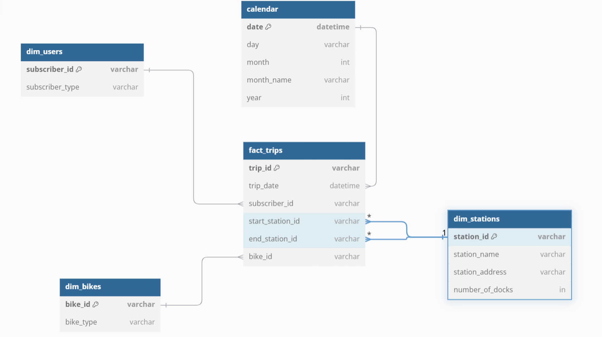

# Análisis del Sistema de Viajes en Bicicleta “Austin” con Power BI y BigQuery
### Por Ilan Ariel Chemaya

## Índice
1. [Presentación de la Temática](#1-presentación-de-la-temática)
2. [Breve descripción de la BBDD](#2-breve-descripción-de-la-bbdd)
3. [ETL Realizado](#3-etl-realizado)
4. [DER (Diagrama Entidad-Relación)](#4-der-diagrama-entidad-relación)
5. [Modelo Entidad-Relación (DER) en la Capa Bronze/Raw](#5-modelo-entidad-relación-der-en-la-capa-bronzeraw)
6. [Plan de Métricas](#6-plan-de-métricas)
7. [Queries Principales](#7-queries-principales)
8. [Cálculos DAX Principales](#8-cálculos-dax-principales)
9. [Conclusión](#9-conclusión)

---

## 1. Presentación de la Temática
El presente proyecto tiene como objetivo realizar un análisis exhaustivo del uso del sistema de bicicletas compartidas en una ciudad utilizando herramientas de análisis como Power BI y BigQuery. El análisis se enfoca en identificar patrones de uso, estacionalidad y comportamientos de diferentes tipos de usuarios, con el fin de proporcionar insights clave para la optimización del servicio.

### Orígenes de Información
- **Datos:** Los datos analizados provienen de registros abiertos de una empresa de bicicletas compartidas que opera a lo largo de los Estados Unidos y Canadá, con información detallada de cada viaje realizado.

### Foco de Análisis
- **Estacionalidad del uso:** Evaluar cómo varía el uso del servicio en diferentes estaciones del año.
- **Uso durante el fin de semana:** Comparar el volumen de viajes entre los fines de semana y los días laborales.
- **Análisis de usuarios:** Identificar qué grupo de usuarios utiliza más el servicio, con un enfoque particular en los estudiantes suscriptores.

### Hipótesis a Analizar
1. **Mayor uso los fines de semana:** Se espera que el uso del servicio de bicicletas sea más alto durante los fines de semana en comparación con los días laborables.
2. **Popularidad en estaciones templadas:** Se espera que el servicio sea más popular durante el otoño y la primavera debido al clima favorable.
3. **Suscriptores estudiantiles como principales usuarios:** Se prevé que los suscriptores estudiantiles son quienes hacen mayor uso del sistema de bicicletas compartidas.


[Volver al inicio](#índice)

---

## 2. Breve descripción de la BBDD
La base de datos está compuesta por dos tablas principales en la capa "bronze", que contienen datos de estaciones de bicicletas y registros de viajes:

### Tablas:
1. **bikeshare_stations:**
   - Contiene información detallada de las estaciones de bicicletas, como el nombre, la ubicación y el estado operativo de las mismas.
   - **Campos principales:**
     - `station_id`: ID único de la estación.
     - `name`: Nombre de la estación.
     - `status`: Estado operativo (activa/inactiva).
     - `address`: Dirección de la estación.
     - `number_of_docks`: Cantidad de espacios disponibles en la estación.

2. **bikeshare_trips:**
   - Registra los viajes realizados por los usuarios, incluyendo la estación de inicio y fin, el tipo de suscriptor, y la duración del viaje.
   - **Campos principales:**
     - `trip_id`: ID único del viaje.
     - `subscriber_type`: Tipo de suscriptor (estudiante, regular, etc.).
     - `bike_id`: ID de la bicicleta utilizada.
     - `start_time`: Fecha y hora de inicio del viaje.
     - `start_station_id`: ID de la estación donde comenzó el viaje.
     - `end_station_id`: ID de la estación donde terminó el viaje.
     - `duration_minutes`: Duración del viaje en minutos.


[Volver al inicio](#índice)

---

## 3. ETL Realizado

### Capa BigQuery:
**Transformaciones en BigQuery:**
- **Unión de tablas:** Se unieron las tablas `bikeshare_stations` y `bikeshare_trips` a través del `station_id` para obtener una vista consolidada de los viajes y las estaciones correspondientes.
- **Transformaciones clave:**
  - Se creó la columna `day_of_week` en base a la fecha del viaje (`start_time`) para identificar el día de la semana en que ocurrió cada viaje.
  - Se generaron columnas adicionales que identifican el mes y el año del viaje, permitiendo análisis temporales más detallados.
  - Se realizó una transformación sobre los tipos de suscriptores (`subscriber_type`), categorizando los diferentes tipos de usuarios.

### Capa Power Query en Power BI:
**Transformaciones en Power BI:**
- **Limpieza de datos:** Se eliminaron registros con datos nulos o inconsistentes relacionados con las estaciones y los viajes.
- **Columnas calculadas:**
  - **Días de la semana:** Se utilizaron las columnas `day_of_week`, `month`, y `year` para analizar patrones de uso por día y mes.
  - **Análisis de suscriptores:** Se realizaron segmentaciones en función del tipo de suscriptor para identificar tendencias de uso en cada grupo de usuarios.

### Métricas Principales:
- **Duración promedio de los viajes:** Cálculo de la duración promedio de los viajes en minutos.
- **Total de viajes:** Cálculo del número total de viajes realizados.
- **Mapa de estaciones:** Se utilizó la ubicación de las estaciones para generar un mapa interactivo en Power BI que muestra cuáles estaciones tienen mayor uso.
- **Número total de estaciones:** Métrica que muestra el total de estaciones activas en el sistema.
- **Viajes por estación:** Relación del promedio de viajes realizados desde cada estación, para identificar patrones de mayor o menor uso.


[Volver al inicio](#índice)

---

## 4. DER (Diagrama Entidad-Relación)
A continuación se presenta el modelo entidad-relación (DER) que muestra las relaciones entre las tablas principales del dataset exportado finalmente a Power BI como capa silver.




[Volver al inicio](#índice)

---

## 5. Modelo Entidad-Relación (DER) en la Capa Bronze/Raw
No se cuenta con un modelo entidad-relación formal en la capa raw, pero se utilizó la siguiente estructura de tablas en la fase inicial:

### 1. bikeshare_stations
- **ID de cada estación:** `station_id`
- **Nombre:** `name`
- **Dirección:** `address`
- **Número de espacios:** `number_of_docks`
- **Otros campos relevantes:** `status`, `city_asset_number`, `council_district`.

### 2. bikeshare_trips
- **ID de cada viaje:** `trip_id`
- **Tipo de suscriptor:** `subscriber_type`
- **ID de estación de inicio:** `start_station_id`
- **Nombre de estación de inicio:** `start_station_name`
- **Estación de fin:** `end_station_id`
- **Nombre de estación de fin:** `end_station_name`
- **Duración:** `duration_minutes`
- **Otros campos relevantes:** `bike_id`, `bike_type`


[Volver al inicio](#índice)

---

## 6. Plan de Métricas
Se puede acceder al plan completo de métricas y KPI a través del siguiente enlace al archivo Excel, donde se detalla cómo cada métrica fue definida y calculada:

[Plan de Métricas en Excel.xlsx](Austin%20Bikeshare%20Métricas.xlsx)


[Volver al inicio](#índice)

---

## 7. Queries Principales
Se presentan, a modo de muestra, las consultas principales que se llevaron a cabo en Big Query.

### Creación de la columna `day_of_week`:


### Join entre las tablas `trips` y `stations`:


### Creación de columnas `month` y `year`:


[Volver al inicio](#índice)

---

## 8. Cálculos DAX Principales
A continuación, se detallan las medidas DAX y columnas calculadas más importantes que fueron utilizadas en el análisis de Power BI:

- **Duración promedio de viajes:**
  ```DAX
  Avg Trip Duration = AVERAGE(fact_trips[duration_minutes])

- **Total de viajes:**
  ```DAX
  Total Trips = COUNT(fact_trips[trip_id])

- **Relación entre cantidad de viajes y estaciones:**
  ```DAX
  Avg Trips per Station = AVERAGEX( VALUES(dim_stations[station_id]), CALCULATE(COUNT(fact_trips[trip_id])))

  
[Volver al inicio](#índice)

---

## 9. Conclusión
Este proyecto permitió validar las hipótesis planteadas sobre el uso del servicio de bicicletas compartidas, identificando un mayor uso en los fines de semana y durante las estaciones templadas, así como el predominio de suscriptores estudiantiles entre los usuarios más frecuentes.

Para visualizar el informe interactivo de Power BI, hacer clic en el siguiente enlace:

[Ver Informe de Power BI](https://app.powerbi.com/view?r=eyJrIjoiNjc2NzUyZTItMDNmNi00NmYyLTk0NzItNTRkZDhjZDYxODJjIiwidCI6Ijc5NTNmYTk0LTk2MjMtNDMzMy04ZGYxLTY5OTk1YzcxNWIyMCIsImMiOjR9&pageName=e06befc058b5806e6581)

Para más información sobre el proyecto o cualquier consulta, puedes contactarme a través de mi perfil de LinkedIn:

[LinkedIn - Ilan Ariel Chemaya](https://www.linkedin.com/in/ilan-ariel-chemaya-782330313/)


[Volver al inicio](#índice)

